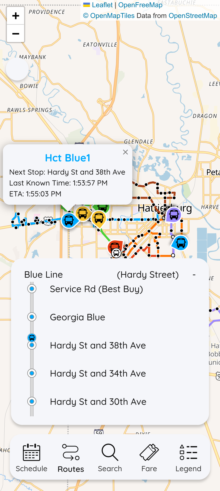
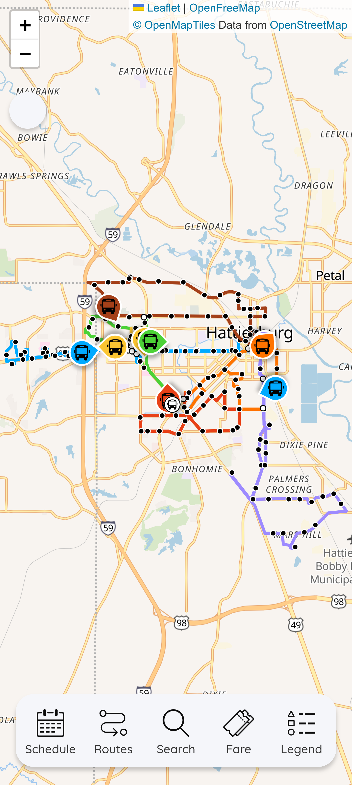
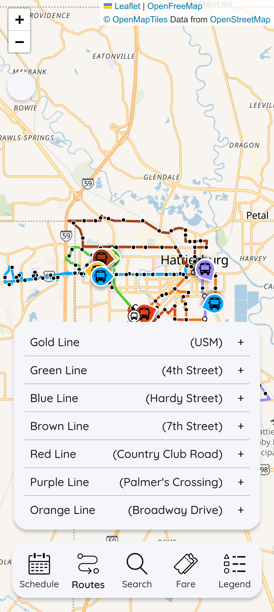

# **[Hub-City Transit Bus Tracker](https://himnshush.github.io/hub-city-transit-v2/)**

## Description

This is my rendition of a transit web app, built from scratch to improve the UI/UX experience. While still in progress, the core functionalities are operational, demonstrating a fresh approach to a transit app by prioritizing essential features and user-friendly design. My goal is to create a more intuitive and visually appealing app that helps users navigate their city's public transportation with ease.

The web app can be accessed via this **[link](https://himnshush.github.io/hub-city-transit-v2/)**.


## Status and Features
 
This project is still under active development, but the essential features are functional. I'm currently working on adding more features and refining the user experience.

### Key Features

* **Next Stop Display:** Calculates and shows the upcoming stop on the route.
* **Time of Arrival (ETA):** Estimates the arrival time for the next stop.
* **Bus Course Display:** Renders the bus's route on the map.
* **Interactive Pop-ups:** Provides quick information about stops and the bus's status.
* **"Fly-to" Feature:** Automatically pans the map to the next stop for a seamless viewing experience.
* **Bus Progression System:** A unique feature that visually represents the bus's progress along the route, proportional to the actual distance covered.
* **Legend Panel:** A user interface to display a legend for the different bus lines and icons on the map.
* **Search Functionality:** A search bar to find specific buses, stops or routes by name.
* **GPS Integration:** An option to use the user's current GPS location to find nearby bus stops.

<p align="center">
  &nbsp;&nbsp;&nbsp;&nbsp;
  &nbsp;&nbsp;&nbsp;&nbsp;
  
</p>

##  Tech Stack

| Category | Technology |
| :--- | :--- |
| **Frontend** | React.js |
| **Mapping & Visualization** | Leaflet |
| **Routing & Traffic** | TomTom Routing API |
| **Styling** | CSS, Framer Motion |
| **Build Tool** | Vite |


##  Data Sources & API Credits

This project leverages industry-standard transit data formats and open-data platforms to provide accurate mapping and tracking.

* **Transit Data ([Transitland](https://www.transit.land/)) :** All static transit entities—including **Stops**, **Routes**, and **Shapes**—are fetched via the Transitland **[GTFS Feed](https://api.transloc.com/gtfs/hct.zip)**
* **ETA: [TomTom Routing API](https://developer.tomtom.com/routing-api/documentation/tomtom-maps/routing-service?source_app=b2b&source_product=routing-apis)** is utilized to calculate real-time, traffic-aware **ETA**.

* **Live Data Feed:** Real-time bus positions are fetched from this **[endpoint](https://utility.arcgis.com/usrsvcs/servers/b02066689d504f5f9428029f7268e060/rest/services/Hosted/8bd5047cc5bf4195887cc5237cf0d3e0_Track_View/FeatureServer/1/query?f=geojson&returnGeometry=true&spatialRel=esriSpatialRelIntersects&geometry={%22xmin%22:-9952239.718110478,%22ymin%22:3657331.85371723454,%22xmax%22:-9933358.86251328,%22ymax%22:3679195.0687008603,%22spatialReference%22:{%22wkid%22:102100}}&geometryType=esriGeometryEnvelope&inSR=102100&outFields=location_timestamp,course,full_name,speed,location_timestamp&returnCentroid=false&returnExceededLimitFeatures=false&outSR=4326")**
.


* **Map Interface:** Base maps and spatial rendering are provided by **[Openfreemap](openfreemap.org) & [OpenStreetMap](https://www.openstreetmap.org/copyright)**.


## API

To ensure the application works correctly, you'll need to configure the API key for the live-transit data. This project uses the Tomtom Routing API to retrieve real-time traffic data to calculate the eta.


## Installation

1.  Clone the repository:
    ```bash
    git clone https://github.com/HimnshuSh/hub-city-transit-v2.git
    ```
2.  Navigate to the project directory:
    ```bash
    cd hub-city-transit-v2/testv1
    ```
3.  Install dependencies:
    ```bash
    npm install
    ```

## Running the App

After installation is complete, start the development server:

```bash
npm run dev